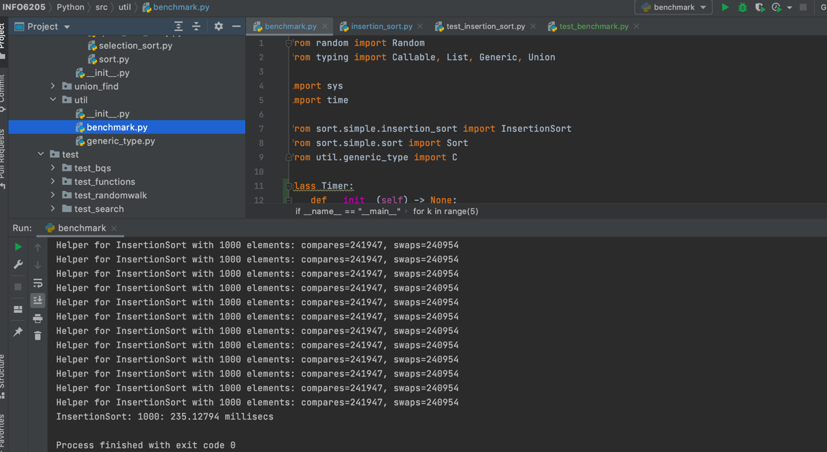
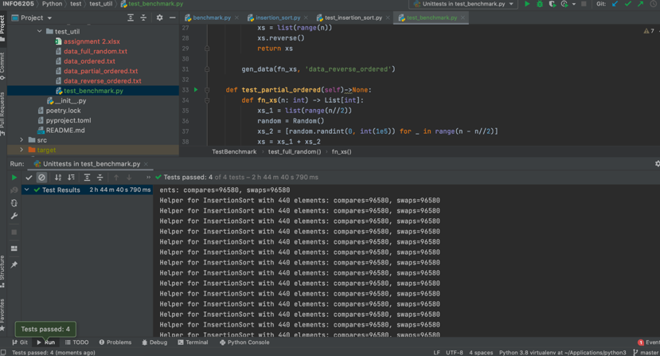

**XINYI WU (001529267)**

# Program Structures & Algorithms
**Spring 2021**
**Assignment No. 2**

### Task:
Insertion sort algorithm, find out the relationship between time complexity and different sizes of array.

###	Output: 
- Output log
	- `/INFO6205/Python/test/test_util/output.log`
- Data points
	- `/INFO6205/Python/test/test_util/data_full_random.txt`
	-	`/INFO6205/Python/test/test_util/data_ordered.txt`
	-	`/INFO6205/Python/test/test_util/data_reverse_ordered.txt`
	-	`/INFO6205/Python/test/test_util/data_partial_ordered.txt`
	
###	Relationship Conclusion: 
When the size of array gets larger, the time complexity gets larger. In general, the relationship between array size (n) and time complexity (t) is roughly like **t = n^2**

When the array is ordered, the time complexity is smallest. When the array is reversed from the ordered one, the time complexity is largest. 

###	Evidence to support the conclusion: 
According to the output logging, the count of compares and the count of swaps increases as the size of array grows. 

In all the types of array ordering, the count of compares only changes with the size of array. The count of swaps changes with both array size and ordering.
- In the ordered situation, the count of swaps is minimum (zero).
- In the reverse ordered situation, the count of swaps is maximum.

###	Graphical representation:
1. ordered:

2. Reverse ordered:

3. Partial ordered:

4. Full random:

###	Unit tests result: 

